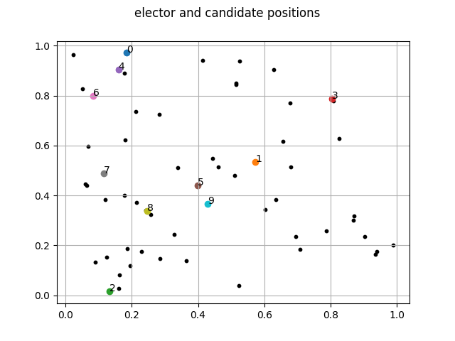

# Voting-Systems-Simulation
Simulation for various voting systems

     

Check out on GitHub

[](https://github.com/Relex12/Voting-Systems-Simulation)

[Lire en Français](https://relex12.github.io/fr/Voting-Systems-Simulation)

---

## Summary

[toc]

## What it is

*   simulate voting systems
*   dimension, position repartition and ranking preferences
*   image of what it looks like
*   what is the goal



## Related work

You might also be interested by [this revue](https://relex12.github.io/Voting-Systems-Comparison) which compares many voting methods, explains how they work and their flaws.

This simulation is inspired by various videos

*   (EN) [Simulating alternate voting systems](https://www.youtube.com/watch?v=yhO6jfHPFQU) by Primer
*   (FR / EN sub) [Réformons l'élection présidentielle !](https://www.youtube.com/watch?v=ZoGH7d51bvc) by ScienceEtonnante
*   (FR / EN sub) [Monsieur le président, avez-vous vraiment gagné cette élection ?](https://www.youtube.com/watch?v=vfTJ4vmIsO4) by La statistique expliquée à mon chat
*   (FR) [Le MEILLEUR système de vote (et pourquoi c'est une mauvaise question)](https://www.youtube.com/watch?v=03NtiW-NXcI) by Tzitzimitl - Esprit Critique

## How to run

If you want to run the simulation, you can do as following

```
git clone https://github.com/Relex12/Voting-Systems-Simulation.git
cd Voting-Systems-Simulation
python3 simulation.py
```

This will give something similar into the output

```
plurality:               6
two round:               9
instant runoff:          9
condorcet:               3
borda:                   3
approval:                3
majority judgement:      3
```

and produce an image as `img/position.png` of the position of the voters and the candidates.

## CLI arguments

You can print the help message by running : `python3 simulation.py -h`

```
usage: simulation.py [-h] [-v] [-d DIMENSION] [-e ELECTORS] [-c CANDIDATES]
                     [-t THRESHOLD] [--noplot] [-r REPEAT] [-o OUTPUT]
                     [--test TEST]

optional arguments:
  -h, --help            show this help message and exit
  -v, --version         show program's version number and exit
  -d DIMENSION, --dimension DIMENSION
                        number of dimensions to use
  -e ELECTORS, --electors ELECTORS
                        number of electors for the simulation
  -c CANDIDATES, --candidates CANDIDATES
                        number of candidates for the simulation
  -t THRESHOLD, --threshold THRESHOLD
                        rejection threshold for scoring methods
  --noplot              creates the positions image
  -r REPEAT, --repeat REPEAT
                        number of repetitions of the simulation
  -o OUTPUT, --output OUTPUT
                        output file to write the results
  --test TEST           number of times to test the method given in the test()
                        function
```

## Introduction to the code

The code is divided in two modules

*   **`simulation.py`** is the main module, it will either computes the undecidability rate of the given method in the source code if `--test` is given as an argument (`test()`), or proceed with the simulation, first drawing lots for the position of voters and candidates (`iniate_dict()`), displaying the position in `position.png` (`plot_grid()`), and finally calculating the distances between the voters and the candidates (`distance()`) before performing the voting systems.
*   **`voting.py`** is the module containing the functions to elect a candidate based on electors preferences, details on the implementation and algorithms are available in the [documentation](https://relex12.github.io/fr/Voting-Systems-Simulation/doc/voting).

## Documentation

The documentation of `simulation.py` and `voting.py` modules is made with [pdoc3](https://pdoc3.github.io/pdoc/). It is available in the `doc/` folder on the repo. You can check it out online :

*   [`simulation.py`](https://relex12.github.io/fr/Voting-Systems-Simulation/doc/simulation)
*   [`voting.py`](https://relex12.github.io/fr/Voting-Systems-Simulation/doc/voting)

To generate the documentation, run `pdoc --html -o doc/ *.py` . You can also view the documentation in your browser at `localhost:8080` by running `pdoc --http : *.py`.

## Flaws in the modeling

*   uniform repartition
*   dimentionnal representation
*   no influence of persons around (like a social network)
*   no media influence
*   no "smart voting" 

## interpretation

## Remaining work

https://interstices.info/comment-designer-le-vainqueur-dune-election/

## License

The project is a small one. The code is given to the GitHub Community  for free, only under the MIT License, that is not too restrictive.